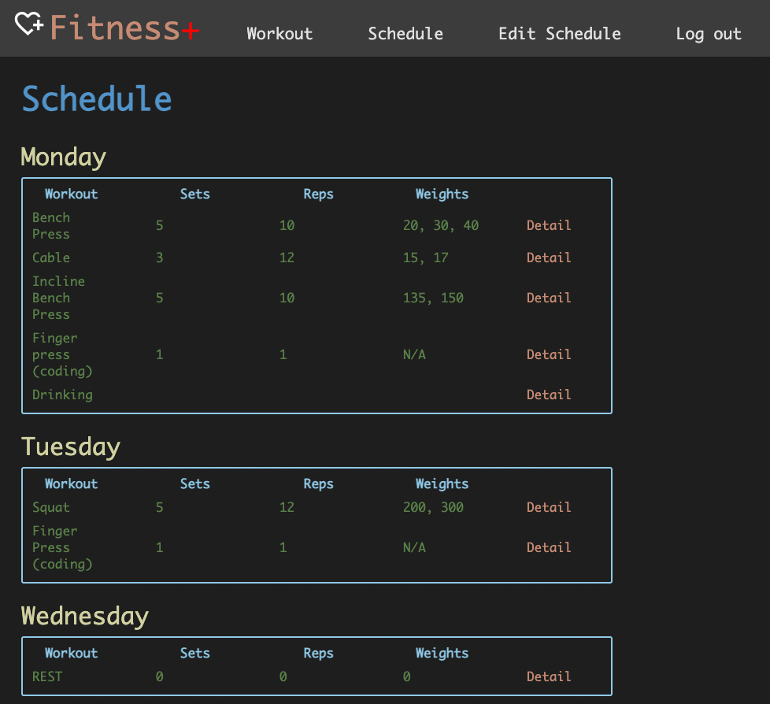
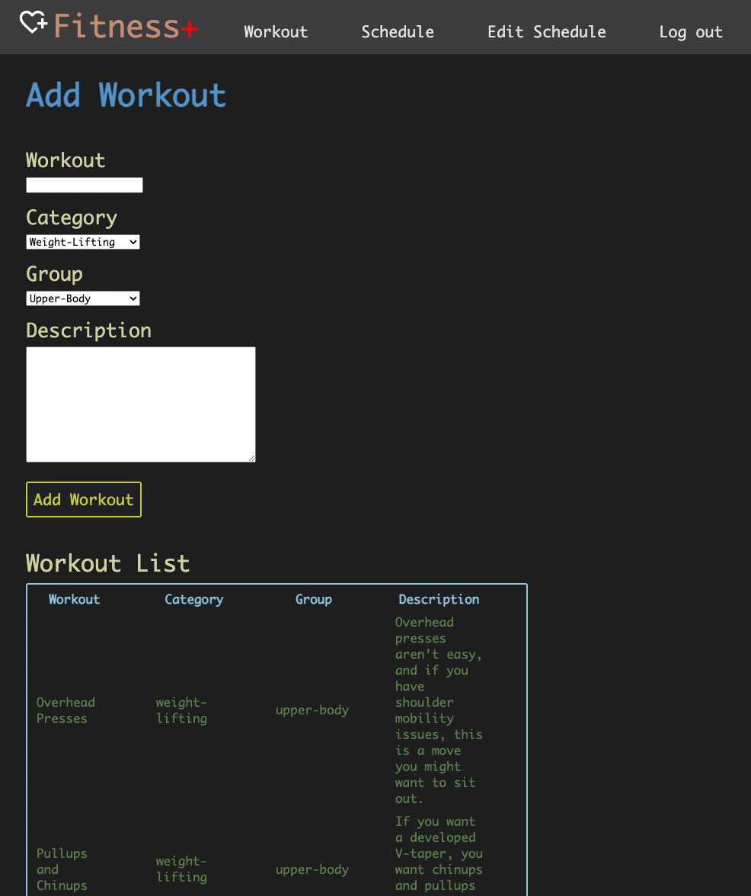
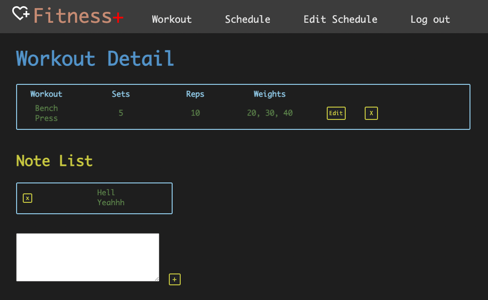
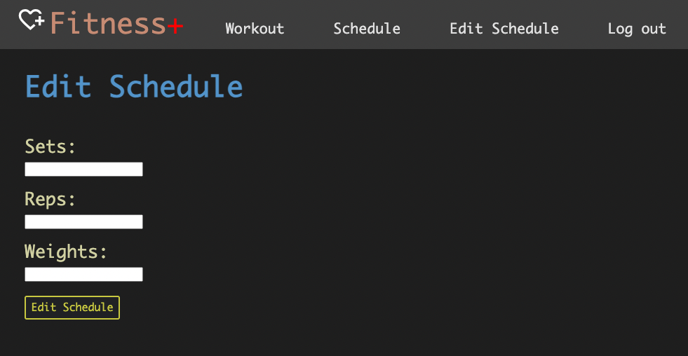

# Workout Planner
[Fitness +](https://heroku-project-02.herokuapp.com/schedules)

---

## Project Description/Features
- Want to build an app that helps user to schedule their workout during the week since health is wealth.
- This app lets user plan for their weekly workout. 
- It also let the user to add their favorite workouts and share it with the community.

---

## Project Screenshots

#### Index Page
 
#### Add Workout Page
 
#### Show/Detail Page
 
#### Edit Page
 

---

## Technologies Used
- HTML
- CSS
- JavaScript
- Express
- EJS
- Mongoose
- MongoDB
- Google Oauth
- Google Fonts
- Google Icon
- Heroku
- Whimsical

---

## Original Wireframe and Planning Concept
- [Trello](https://whimsical.com/ga-project-02-WfMXTfDJiFG2nbeKqdyxmG)
- [ERD](https://lucid.app/lucidchart/33d6ab39-7949-43c8-b828-3e0ead6245bb/edit?view_items=~7TL2xNExdQy%2C7-TL7n03F8z7%2Cg5TL~QOm0nG4%2CoCpMS3jNEBky%2C5mULj6G8NYB9&invitationId=inv_e674c9e9-dc2d-4bb4-be45-b9f0536e9d9e#)
- [Wireframe](https://whimsical.com/ga-project-02-WfMXTfDJiFG2nbeKqdyxmG)
- [Pseudocode](https://docs.google.com/document/d/1VOesUp2EXA2j8L3ZddxWR7f7b98kpJwnNBxCJGTCCo4/edit?usp=sharing)

---
## Wins
Familiarize with how back-end works. Refresh memory on CSS and HTML manipulations.

---

## Hurdles
Initially I was stuck with how everything is connected to each other (routes, controllers, ejs, models). However, after extensive research and going back to the lectures, I was able to figure out and understand the basics.

---

## Future Add-Ons
- Let the User to update their schedule for a month
- Linked the Workout Schema to the Schedule Schema
- Add pictures to the Workout Schema
- Add Category Schema, for example, if select weight-lifting-category, only the workouts from this category will show up as selections.

---

## Credits
- Everyone who helped me (directly and indirectly) during the process! Thank you all!